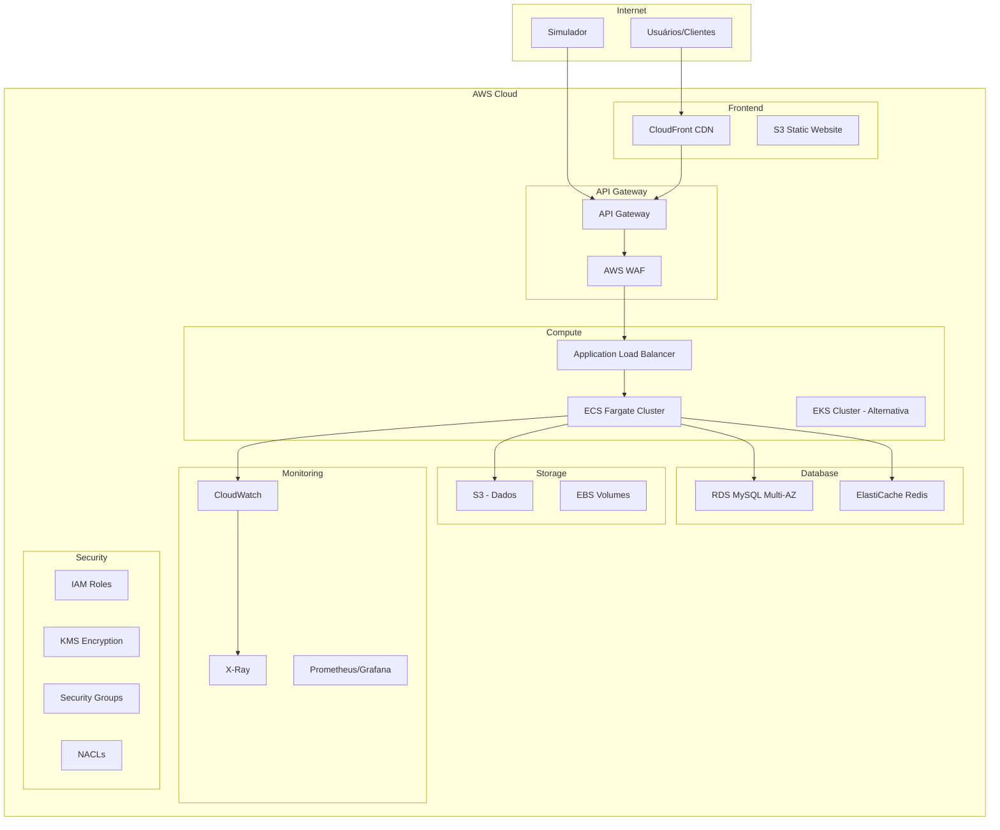

# 🏗️ Arquitetura Cloud AWS - Sistema de Gerenciamento de Estacionamento

## 📋 Visão Geral

Este documento apresenta uma arquitetura cloud completa e escalável para o sistema de gerenciamento de estacionamento Estapar, utilizando serviços da AWS com foco em segurança, performance e escalabilidade.

---

## 🎯 Objetivos da Arquitetura

- **Escalabilidade**: Suporte a crescimento automático de carga
- **Alta Disponibilidade**: 99.9% de uptime
- **Segurança**: Proteção de dados e compliance
- **Performance**: Resposta rápida e baixa latência
- **Custo-efetividade**: Otimização de recursos
- **Monitoramento**: Observabilidade completa

---

## 🏛️ Arquitetura de Alto Nível



---

## 🔧 Componentes da Arquitetura

### 1. **Frontend & CDN**

#### **Amazon CloudFront**
- **Propósito**: CDN global para distribuição de conteúdo
- **Benefícios**: 
  - Redução de latência
  - Cache inteligente
  - DDoS protection integrada
- **Configuração**:
  ```yaml
  Distribution:
    Origins: [S3, ALB]
    CacheBehaviors:
      - PathPattern: "/api/*"
        TargetOriginId: "api-gateway"
        CachePolicy: "Managed-CachingDisabled"
      - PathPattern: "/*"
        TargetOriginId: "s3-static"
        CachePolicy: "Managed-CachingOptimized"
    PriceClass: "PriceClass_100" # América do Norte e Europa
  ```

#### **Amazon S3 (Static Website Hosting)**
- **Propósito**: Hospedagem de documentação Swagger e frontend
- **Configuração**:
  ```yaml
  Bucket: "estapar-parking-docs-prod"
  WebsiteConfiguration:
    IndexDocument: "index.html"
    ErrorDocument: "error.html"
  PublicAccessBlock: false
  BucketPolicy:
    AllowCloudFrontOAI: true
  ```

### 2. **API Gateway & Security**

#### **Amazon API Gateway**
- **Propósito**: Gateway de API centralizado
- **Recursos**:
  - Rate limiting
  - Request/Response transformation
  - API versioning
  - Caching
- **Configuração**:
  ```yaml
  API:
    Name: "estapar-parking-api"
    Type: "REST"
    EndpointConfiguration:
      Type: "REGIONAL"
    ThrottleSettings:
      BurstLimit: 5000
      RateLimit: 1000
    CacheClusterEnabled: true
    CacheClusterSize: "0.5"
    StageVariables:
      - "RDS_ENDPOINT"
      - "REDIS_ENDPOINT"
  ```

#### **AWS WAF (Web Application Firewall)**
- **Propósito**: Proteção contra ataques web
- **Regras**:
  ```yaml
  Rules:
    - Name: "RateLimitRule"
      Priority: 1
      Action: "BLOCK"
      Statement:
        RateBasedStatement:
          Limit: 2000
          AggregateKeyType: "IP"
    
    - Name: "SQLInjectionRule"
      Priority: 2
      Action: "BLOCK"
      Statement:
        ByteMatchStatement:
          SearchString: "union select"
          FieldToMatch: "BODY"
    
    - Name: "XSSRule"
      Priority: 3
      Action: "BLOCK"
      Statement:
        XssMatchStatement:
          FieldToMatch: "BODY"
  ```

### 3. **Compute Layer**

#### **Amazon ECS Fargate (Recomendado)**
- **Vantagens**:
  - Serverless containers
  - Auto-scaling
  - Sem gerenciamento de servidores
  - Pay-per-use

- **Configuração do Cluster**:
  ```yaml
  Cluster:
    Name: "estapar-parking-cluster"
    CapacityProviders:
      - "FARGATE"
      - "FARGATE_SPOT"
    DefaultCapacityProviderStrategy:
      - CapacityProvider: "FARGATE"
        Weight: 1
      - CapacityProvider: "FARGATE_SPOT"
        Weight: 4
  
  TaskDefinition:
    Family: "estapar-parking-app"
    NetworkMode: "awsvpc"
    RequiresCompatibilities: ["FARGATE"]
    Cpu: "512"
    Memory: "1024"
    ExecutionRoleArn: "arn:aws:iam::account:role/ecsTaskExecutionRole"
    TaskRoleArn: "arn:aws:iam::account:role/ecsTaskRole"
    ContainerDefinitions:
      - Name: "parking-app"
        Image: "account.dkr.ecr.region.amazonaws.com/estapar-parking:latest"
        PortMappings:
          - ContainerPort: 3003
            Protocol: "tcp"
        Environment:
          - Name: "SPRING_PROFILES_ACTIVE"
            Value: "aws"
          - Name: "RDS_ENDPOINT"
            Value: "${RDS_ENDPOINT}"
          - Name: "REDIS_ENDPOINT"
            Value: "${REDIS_ENDPOINT}"
        LogConfiguration:
          LogDriver: "awslogs"
          Options:
            awslogs-group: "/ecs/estapar-parking"
            awslogs-region: "us-east-1"
            awslogs-stream-prefix: "ecs"
  ```

#### **Application Load Balancer (ALB)**
- **Configuração**:
  ```yaml
  LoadBalancer:
    Name: "estapar-parking-alb"
    Scheme: "internet-facing"
    Type: "application"
    IpAddressType: "ipv4"
    Subnets:
      - "subnet-12345" # Public subnet AZ-1
      - "subnet-67890" # Public subnet AZ-2
    
    Listeners:
      - Port: 80
        Protocol: "HTTP"
        DefaultActions:
          - Type: "redirect"
            RedirectConfig:
              Protocol: "HTTPS"
              Port: "443"
              StatusCode: "HTTP_301"
      
      - Port: 443
        Protocol: "HTTPS"
        Certificates:
          - CertificateArn: "arn:aws:acm:region:account:certificate/cert-id"
        DefaultActions:
          - Type: "forward"
            TargetGroupArn: "${TARGET_GROUP_ARN}"
    
    TargetGroups:
      - Name: "estapar-parking-tg"
        Protocol: "HTTP"
        Port: 3003
        VpcId: "${VPC_ID}"
        TargetType: "ip"
        HealthCheckPath: "/actuator/health"
        HealthCheckIntervalSeconds: 30
        HealthyThresholdCount: 2
        UnhealthyThresholdCount: 3
  ```

#### **Auto Scaling**
- **Configuração**:
  ```yaml
  AutoScalingGroup:
    MinSize: 2
    MaxSize: 20
    DesiredCapacity: 4
    TargetTrackingScalingPolicies:
      - TargetValue: 70.0
        PredefinedMetricSpecification:
          PredefinedMetricType: "ECSServiceAverageCPUUtilization"
      - TargetValue: 80.0
        PredefinedMetricSpecification:
          PredefinedMetricType: "ECSServiceAverageMemoryUtilization"
  ```

### 4. **Database Layer**

#### **Amazon RDS MySQL**
- **Configuração Multi-AZ**:
  ```yaml
  DBInstance:
    Engine: "mysql"
    EngineVersion: "8.0.35"
    DBInstanceClass: "db.t3.medium"
    MultiAZ: true
    StorageType: "gp3"
    AllocatedStorage: 100
    MaxAllocatedStorage: 1000
    StorageEncrypted: true
    BackupRetentionPeriod: 7
    BackupWindow: "03:00-04:00"
    MaintenanceWindow: "sun:04:00-sun:05:00"
    MonitoringInterval: 60
    MonitoringRoleArn: "arn:aws:iam::account:role/rds-monitoring-role"
    
    VpcSecurityGroupIds:
      - "${DB_SECURITY_GROUP}"
    
    DBParameterGroupName: "estapar-parking-mysql-params"
    OptionGroupName: "estapar-parking-mysql-options"
    
    ReadReplicas:
      - DBInstanceIdentifier: "estapar-parking-read-replica"
        DBInstanceClass: "db.t3.small"
        PubliclyAccessible: false
  ```

#### **Amazon ElastiCache Redis**
- **Configuração**:
  ```yaml
  CacheCluster:
    Engine: "redis"
    CacheNodeType: "cache.t3.micro"
    NumCacheNodes: 2
    EngineVersion: "7.0.7"
    ParameterGroupName: "default.redis7"
    CacheSubnetGroupName: "estapar-parking-redis-subnet"
    SecurityGroupIds:
      - "${REDIS_SECURITY_GROUP}"
    
    ReplicationGroup:
      ReplicationGroupId: "estapar-parking-redis"
      Description: "Redis cluster for session and cache"
      NodeType: "cache.t3.micro"
      Port: 6379
      NumCacheClusters: 2
      AutomaticFailoverEnabled: true
      MultiAZEnabled: true
      AtRestEncryptionEnabled: true
      TransitEncryptionEnabled: true
  ```

### 5. **Storage & Data**

#### **Amazon S3**
- **Buckets**:
  ```yaml
  Buckets:
    - Name: "estapar-parking-logs-prod"
      Purpose: "Application logs"
      LifecycleConfiguration:
        Rules:
          - Id: "LogLifecycle"
            Status: "Enabled"
            Transitions:
              - Days: 30
                StorageClass: "STANDARD_IA"
              - Days: 90
                StorageClass: "GLACIER"
              - Days: 365
                StorageClass: "DEEP_ARCHIVE"
    
    - Name: "estapar-parking-backups-prod"
      Purpose: "Database backups"
      Versioning: "Enabled"
      Encryption: "AES256"
    
    - Name: "estapar-parking-config-prod"
      Purpose: "Configuration files"
      Encryption: "KMS"
  ```

### 6. **Monitoring & Observability**

#### **Amazon CloudWatch**
- **Logs**:
  ```yaml
  LogGroups:
    - LogGroupName: "/ecs/estapar-parking"
      RetentionInDays: 30
      MetricFilters:
        - FilterName: "ErrorCount"
          FilterPattern: "ERROR"
          MetricTransformations:
            - MetricName: "ErrorCount"
              MetricNamespace: "Estapar/Parking"
              MetricValue: "1"
    
    - LogGroupName: "/aws/rds/instance/estapar-parking-mysql/mysql-error"
      RetentionInDays: 7
    
    - LogGroupName: "/aws/apigateway/estapar-parking-api"
      RetentionInDays: 14
  ```

- **Dashboards**:
  ```yaml
  Dashboard:
    Name: "EstaparParkingDashboard"
    Widgets:
      - Type: "Graph"
        Properties:
          Metrics:
            - ["AWS/ECS", "CPUUtilization", "ServiceName", "estapar-parking"]
            - ["AWS/ECS", "MemoryUtilization", "ServiceName", "estapar-parking"]
            - ["AWS/ApplicationELB", "TargetResponseTime", "LoadBalancer", "estapar-parking-alb"]
            - ["AWS/RDS", "CPUUtilization", "DBInstanceIdentifier", "estapar-parking-mysql"]
          Period: 300
          Stat: "Average"
          Region: "us-east-1"
          Title: "System Performance"
  ```

#### **AWS X-Ray**
- **Configuração**:
  ```yaml
  XRay:
    SamplingRule:
      RuleName: "EstaparParkingSampling"
      Priority: 1
      FixedRate: 0.1 # 10% sampling
      HTTPMethod: "*"
      URLPath: "*"
      ServiceName: "estapar-parking"
      ServiceType: "AWS::ECS::Service"
  ```

#### **Prometheus + Grafana (Opcional)**
- **Configuração**:
  ```yaml
  Prometheus:
    Namespace: "monitoring"
    ConfigMap:
      scrape_configs:
        - job_name: "estapar-parking"
          static_configs:
            - targets: ["estapar-parking-alb:8080/metrics"]
          scrape_interval: 15s
          metrics_path: "/actuator/prometheus"
  
  Grafana:
    Dashboards:
      - "Spring Boot Metrics"
      - "JVM Metrics"
      - "Database Metrics"
      - "Custom Business Metrics"
  ```

### 7. **Security & Compliance**

#### **IAM Roles & Policies**
- **ECS Task Role**:
  ```json
  {
    "Version": "2012-10-17",
    "Statement": [
      {
        "Effect": "Allow",
        "Action": [
          "rds:DescribeDBInstances",
          "rds:DescribeDBClusters"
        ],
        "Resource": "*"
      },
      {
        "Effect": "Allow",
        "Action": [
          "elasticache:DescribeCacheClusters",
          "elasticache:DescribeReplicationGroups"
        ],
        "Resource": "*"
      },
      {
        "Effect": "Allow",
        "Action": [
          "s3:GetObject",
          "s3:PutObject",
          "s3:DeleteObject"
        ],
        "Resource": "arn:aws:s3:::estapar-parking-*/*"
      }
    ]
  }
  ```

#### **VPC & Network Security**
- **VPC Configuration**:
  ```yaml
  VPC:
    CidrBlock: "10.0.0.0/16"
    EnableDnsHostnames: true
    EnableDnsSupport: true
    
    Subnets:
      Public:
        - CidrBlock: "10.0.1.0/24"
          AvailabilityZone: "us-east-1a"
        - CidrBlock: "10.0.2.0/24"
          AvailabilityZone: "us-east-1b"
      
      Private:
        - CidrBlock: "10.0.11.0/24"
          AvailabilityZone: "us-east-1a"
        - CidrBlock: "10.0.12.0/24"
          AvailabilityZone: "us-east-1b"
      
      Database:
        - CidrBlock: "10.0.21.0/24"
          AvailabilityZone: "us-east-1a"
        - CidrBlock: "10.0.22.0/24"
          AvailabilityZone: "us-east-1b"
    
    SecurityGroups:
      - Name: "estapar-parking-alb-sg"
        Description: "Security group for ALB"
        Ingress:
          - Port: 80
            Protocol: "tcp"
            CidrBlocks: ["0.0.0.0/0"]
          - Port: 443
            Protocol: "tcp"
            CidrBlocks: ["0.0.0.0/0"]
      
      - Name: "estapar-parking-ecs-sg"
        Description: "Security group for ECS tasks"
        Ingress:
          - Port: 3003
            Protocol: "tcp"
            SourceSecurityGroupId: "${ALB_SECURITY_GROUP}"
      
      - Name: "estapar-parking-db-sg"
        Description: "Security group for RDS"
        Ingress:
          - Port: 3306
            Protocol: "tcp"
            SourceSecurityGroupId: "${ECS_SECURITY_GROUP}"
      
      - Name: "estapar-parking-redis-sg"
        Description: "Security group for Redis"
        Ingress:
          - Port: 6379
            Protocol: "tcp"
            SourceSecurityGroupId: "${ECS_SECURITY_GROUP}"
  ```

#### **AWS KMS Encryption**
- **Configuração**:
  ```yaml
  KMS:
    Keys:
      - Alias: "estapar-parking-rds"
        Description: "KMS key for RDS encryption"
        KeyPolicy:
          Statement:
            - Sid: "Enable IAM User Permissions"
              Effect: "Allow"
              Principal:
                AWS: "arn:aws:iam::${ACCOUNT_ID}:root"
              Action: "kms:*"
              Resource: "*"
      
      - Alias: "estapar-parking-s3"
        Description: "KMS key for S3 encryption"
        KeyUsage: "ENCRYPT_DECRYPT"
        KeySpec: "SYMMETRIC_DEFAULT"
  ```

---

## 🚀 Estratégia de Deployment

### **CI/CD Pipeline (GitHub Actions)**
```yaml
name: Deploy to AWS

on:
  push:
    branches: [main]
  pull_request:
    branches: [main]

jobs:
  test:
    runs-on: ubuntu-latest
    steps:
      - uses: actions/checkout@v3
      - name: Set up JDK 21
        uses: actions/setup-java@v3
        with:
          java-version: '21'
          distribution: 'temurin'
      - name: Run tests
        run: mvn test
      - name: Build Docker image
        run: docker build -t estapar-parking:${{ github.sha }} .

  deploy:
    needs: test
    runs-on: ubuntu-latest
    if: github.ref == 'refs/heads/main'
    steps:
      - name: Configure AWS credentials
        uses: aws-actions/configure-aws-credentials@v2
        with:
          aws-access-key-id: ${{ secrets.AWS_ACCESS_KEY_ID }}
          aws-secret-access-key: ${{ secrets.AWS_SECRET_ACCESS_KEY }}
          aws-region: us-east-1
      
      - name: Login to Amazon ECR
        id: login-ecr
        uses: aws-actions/amazon-ecr-login@v1
      
      - name: Build, tag, and push image to Amazon ECR
        env:
          ECR_REGISTRY: ${{ steps.login-ecr.outputs.registry }}
          ECR_REPOSITORY: estapar-parking
          IMAGE_TAG: ${{ github.sha }}
        run: |
          docker build -t $ECR_REGISTRY/$ECR_REPOSITORY:$IMAGE_TAG .
          docker push $ECR_REGISTRY/$ECR_REPOSITORY:$IMAGE_TAG
          docker tag $ECR_REGISTRY/$ECR_REPOSITORY:$IMAGE_TAG $ECR_REGISTRY/$ECR_REPOSITORY:latest
          docker push $ECR_REGISTRY/$ECR_REPOSITORY:latest
      
      - name: Deploy to ECS
        run: |
          aws ecs update-service \
            --cluster estapar-parking-cluster \
            --service estapar-parking-service \
            --force-new-deployment
```

### **Blue/Green Deployment**
```yaml
BlueGreenDeployment:
  TrafficShift:
    - TargetGroup: "blue-tg"
      Weight: 100
    - TargetGroup: "green-tg"
      Weight: 0
  
  DeploymentSteps:
    1. Deploy to Green Environment
    2. Run Health Checks
    3. Shift 10% traffic to Green
    4. Monitor for 5 minutes
    5. Shift 50% traffic to Green
    6. Monitor for 10 minutes
    7. Shift 100% traffic to Green
    8. Terminate Blue Environment
```

---

## 📊 Monitoramento & Alertas

### **CloudWatch Alarms**
```yaml
Alarms:
  - AlarmName: "HighCPUUtilization"
    MetricName: "CPUUtilization"
    Namespace: "AWS/ECS"
    Statistic: "Average"
    Period: 300
    EvaluationPeriods: 2
    Threshold: 80
    ComparisonOperator: "GreaterThanThreshold"
    AlarmActions:
      - "arn:aws:sns:us-east-1:account:estapar-alerts"
  
  - AlarmName: "HighResponseTime"
    MetricName: "TargetResponseTime"
    Namespace: "AWS/ApplicationELB"
    Statistic: "Average"
    Period: 60
    EvaluationPeriods: 3
    Threshold: 2.0
    ComparisonOperator: "GreaterThanThreshold"
  
  - AlarmName: "DatabaseConnectionFailure"
    MetricName: "DatabaseConnections"
    Namespace: "AWS/RDS"
    Statistic: "Average"
    Period: 300
    EvaluationPeriods: 2
    Threshold: 80
    ComparisonOperator: "GreaterThanThreshold"
```

### **SNS Notifications**
```yaml
SNS:
  Topics:
    - Name: "estapar-alerts"
      DisplayName: "Estapar Parking Alerts"
      Subscriptions:
        - Protocol: "email"
          Endpoint: "devops@estapar.com"
        - Protocol: "sms"
          Endpoint: "+1234567890"
        - Protocol: "slack"
          Endpoint: "https://hooks.slack.com/services/..."
```

---

## 💰 Estimativa de Custos (Mensal)

### **Serviços Principais**
| Serviço | Configuração | Custo Estimado |
|---------|--------------|----------------|
| **ECS Fargate** | 4 tasks × 1 vCPU × 2GB | $120 |
| **RDS MySQL** | db.t3.medium Multi-AZ | $150 |
| **ElastiCache Redis** | 2 nodes cache.t3.micro | $30 |
| **ALB** | 1 load balancer | $25 |
| **CloudFront** | 1TB transfer | $85 |
| **S3** | 100GB storage + requests | $15 |
| **CloudWatch** | Logs + metrics | $50 |
| **API Gateway** | 1M requests | $35 |
| **Route 53** | Hosted zone + queries | $5 |
| **NAT Gateway** | 2 gateways | $90 |

**Total Estimado: ~$605/mês**

### **Otimizações de Custo**
1. **Spot Instances**: Usar FARGATE_SPOT para 70% de economia
2. **Reserved Instances**: Para RDS (até 69% de desconto)
3. **S3 Intelligent Tiering**: Redução automática de custos
4. **CloudWatch Logs**: Lifecycle policies para arquivamento

---

## 🔒 Segurança & Compliance

### **Security Best Practices**
1. **Princípio do Menor Privilégio**: IAM roles específicos
2. **Criptografia em Trânsito**: TLS 1.2+ em todas as comunicações
3. **Criptografia em Repouso**: KMS para dados sensíveis
4. **Network Segmentation**: VPC com subnets isoladas
5. **Logging Centralizado**: CloudTrail + CloudWatch
6. **Backup Automático**: RDS automated backups
7. **Disaster Recovery**: Multi-AZ + cross-region backups

### **Compliance**
- **LGPD**: Controle de dados pessoais
- **PCI DSS**: Para pagamentos (se aplicável)
- **ISO 27001**: Gestão de segurança da informação
- **SOC 2**: Controles de segurança

---

## 📈 Roadmap de Escalabilidade

### **Fase 1: MVP (0-1k usuários)**
- ECS Fargate com 2-4 tasks
- RDS MySQL Single-AZ
- ElastiCache Redis single node
- CloudWatch básico

### **Fase 2: Crescimento (1k-10k usuários)**
- Auto-scaling ECS
- RDS Multi-AZ + Read Replica
- ElastiCache Redis Cluster
- WAF + Shield Advanced

### **Fase 3: Escala (10k+ usuários)**
- EKS cluster com HPA
- RDS Aurora MySQL
- ElastiCache Redis Cluster Mode
- Multi-region deployment
- Service Mesh (Istio)

### **Fase 4: Enterprise (100k+ usuários)**
- Microservices architecture
- Event-driven architecture (Kinesis/SQS)
- Advanced monitoring (Prometheus/Grafana)
- Chaos engineering
- Blue/green deployments

---

## 🛠️ Ferramentas de DevOps

### **Infrastructure as Code**
- **Terraform**: Para provisionamento de recursos
- **AWS CDK**: Para desenvolvimento em Python/TypeScript
- **CloudFormation**: Para templates AWS nativos

### **Container Registry**
- **Amazon ECR**: Registry privado para imagens Docker
- **Image Scanning**: Vulnerability scanning automático
- **Lifecycle Policies**: Limpeza automática de imagens antigas

### **Secrets Management**
- **AWS Secrets Manager**: Para credenciais de banco
- **AWS Parameter Store**: Para configurações da aplicação
- **AWS Certificate Manager**: Para certificados SSL/TLS

---

## 📝 Checklist de Implementação

### **Preparação**
- [ ] Configurar AWS CLI e credenciais
- [ ] Criar VPC e subnets
- [ ] Configurar Security Groups
- [ ] Criar IAM roles e policies

### **Banco de Dados**
- [ ] Provisionar RDS MySQL Multi-AZ
- [ ] Configurar ElastiCache Redis
- [ ] Executar migrações de schema
- [ ] Configurar backups automáticos

### **Aplicação**
- [ ] Criar ECR repository
- [ ] Build e push da imagem Docker
- [ ] Configurar ECS cluster e service
- [ ] Configurar ALB e target groups

### **Monitoramento**
- [ ] Configurar CloudWatch logs
- [ ] Criar dashboards
- [ ] Configurar alarmes
- [ ] Configurar SNS notifications

### **Segurança**
- [ ] Configurar WAF rules
- [ ] Habilitar AWS Shield
- [ ] Configurar KMS keys
- [ ] Implementar encryption

### **CI/CD**
- [ ] Configurar GitHub Actions
- [ ] Implementar pipeline de deploy
- [ ] Configurar testes automatizados
- [ ] Implementar blue/green deployment

---

## 🎯 Conclusão

Esta arquitetura AWS fornece uma base sólida, escalável e segura para o sistema de gerenciamento de estacionamento Estapar. Com foco em:

- **Alta Disponibilidade**: Multi-AZ deployment
- **Escalabilidade**: Auto-scaling e containers serverless
- **Segurança**: Múltiplas camadas de proteção
- **Monitoramento**: Observabilidade completa
- **Custo-efetividade**: Otimização de recursos

A arquitetura é projetada para crescer com o negócio, desde o MVP até uma solução enterprise completa.

---

**📞 Suporte**: Para dúvidas sobre implementação, entre em contato com a equipe de DevOps.

**📚 Documentação**: Consulte a documentação AWS oficial para detalhes específicos de cada serviço.
